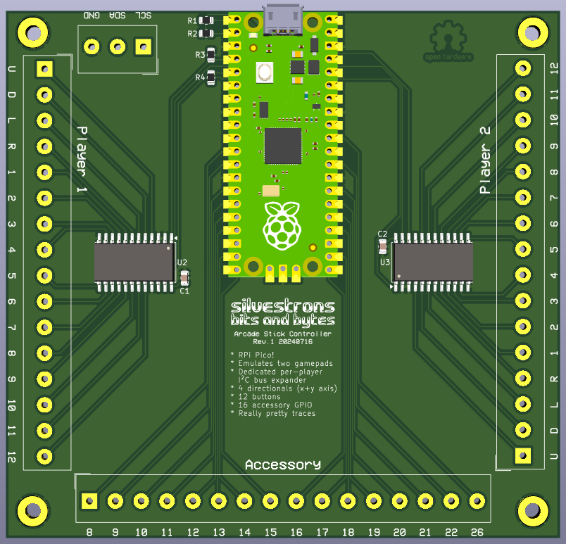
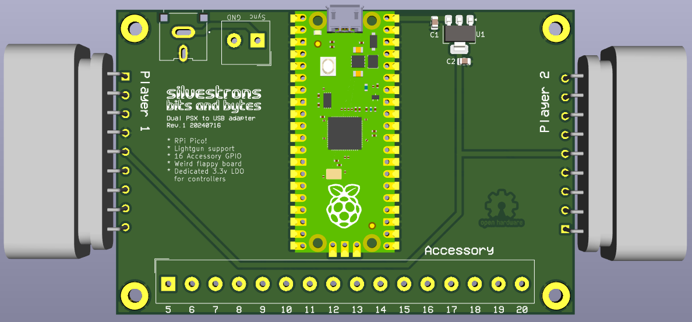
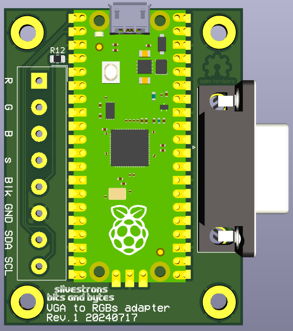
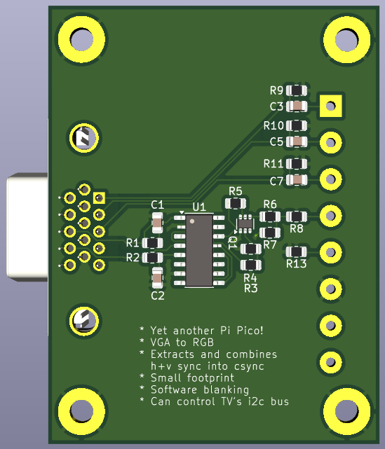

# Arcade machine

This is a collection of circuits that I designed and built in order to build my own arcade machine.

I probably could have picked up off-the-shelf items for any and all of these, but I wanted to make my own for fun.

## Stick

Takes the joystick and buttons inputs and emulates two gamepads over USB. Each gamepad supports 16 buttons, which allows for four directionals and 12 actions per "player". The two players are provided by I2C I/O expanders.

The spare GPIO on the Pi Pico are expanded out as well, in case I'd like to use them later for something else.

## PSX

One of the goals of my machine was to support lightgun games, and I decided I wanted to use the existing Namco Guncon lightguns I already had. So this does that.

It also provides an additional 16 GPIO, for whatever else might take my fancy. With this and the spare GPIO above in the Stick, I could theoretically make a 4 player cabinet!

## VGA to RGB

Driving my arcade cabinet is a regular PC running Batocera, and I am using VGA output. The CRT I'm using can be modded to support RGB, and this board handles that stuff, plus converting the h+v sync signals from VGA into csync for the TV to handle.

The TV I used also has a quirk where it disables RGB blanking via "software" at startup, so this board's Pi Pico can interface with the i2c bus onboard the TV and send the commands to re-enable RGB blanking when ready, and I also made the Pico control RGB blanking, so we can make sure we don't enable blanking before the computer is booted to make sure we don't send a 30khz signal and damage anything...

 

## License

All PCB designs are [CERN OHL v2 Strongly Reciprocal licensed](LICENSE-HW.md)

All Software is [MIT licensed](LICENSE-SW.md)

Copyright 2024 silvestron's bits and bytes